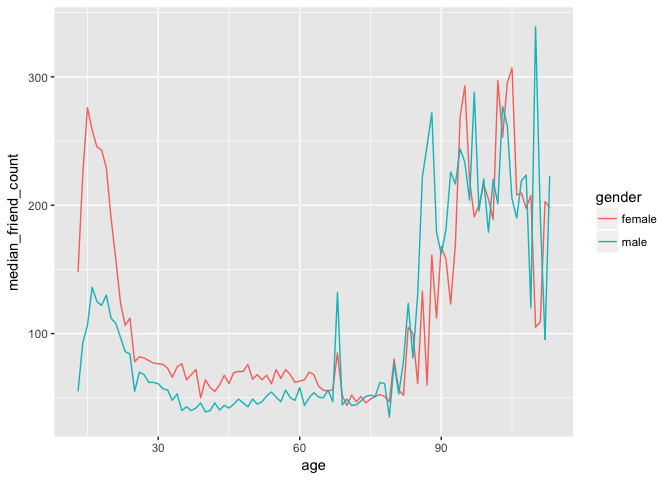
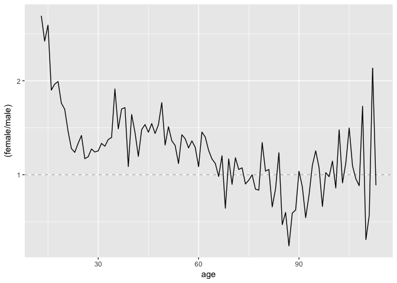
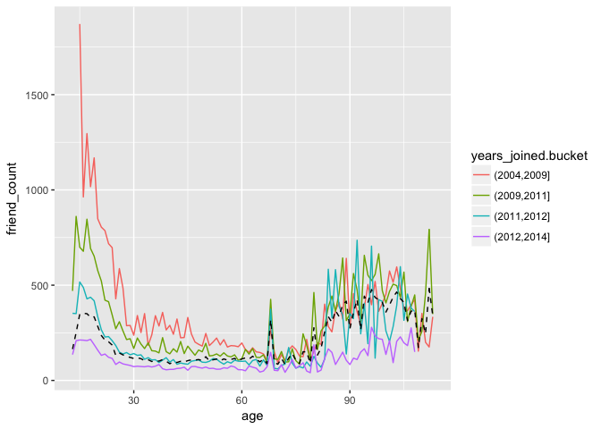
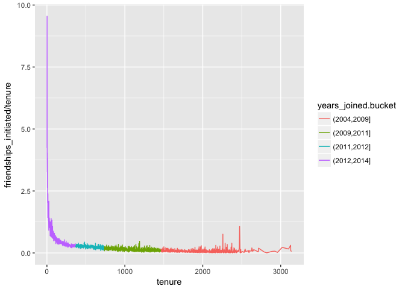
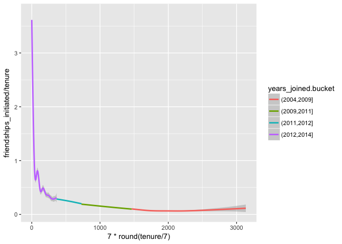
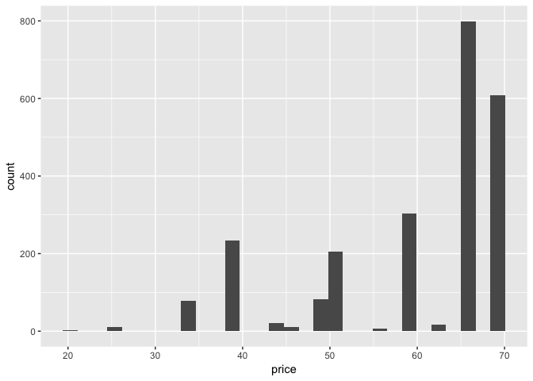
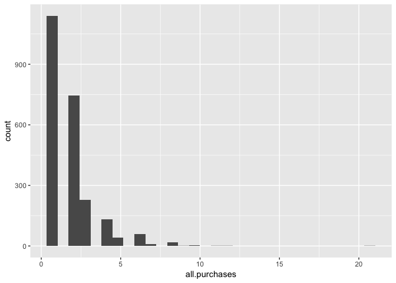
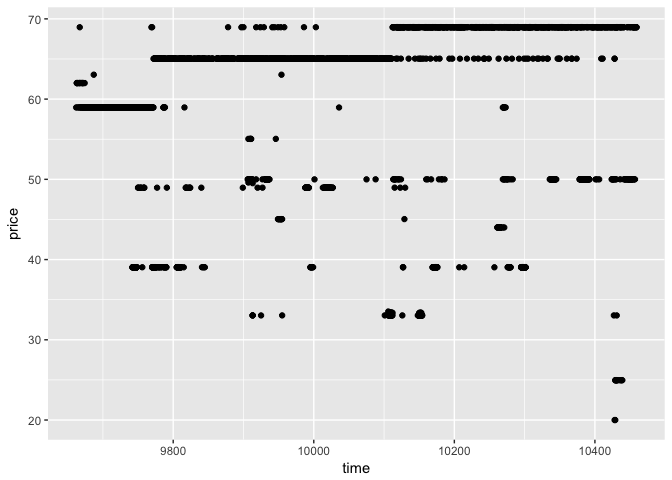
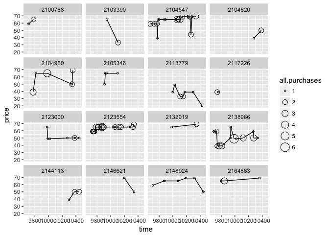
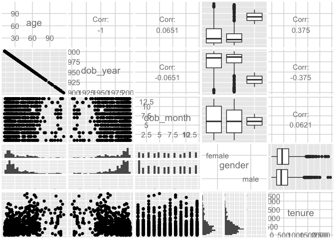

Import necessary libraries and data sets

```r
library(ggplot2)
library(gridExtra)
library(dplyr) 
library(tidyr)
library(reshape2)
library(GGally)
```

Setting seed for reproducibility

```r
set.seed(1234)
```

Load pseudo facebook data set

```r
destfile <- "input/pseudo_facebook.tsv"

if(!file.exists(destfile)){
  download.file("https://s3.amazonaws.com/udacity-hosted-downloads/ud651/pseudo_facebook.tsv",destfile=destfile,method="libcurl")
}
pseudo_facebook <- read.csv(file=destfile, sep="\t")
```

New dataframe arranged by age and gender

```r
pf.fc_by_age_gender <- pseudo_facebook %>%
  subset(!is.na(gender)) %>%
  group_by(age, gender) %>% 
  summarise(mean_friend_count = mean(friend_count)
            , median_friend_count = median(friend_count)
            , n = n()) %>%
  arrange(age, gender)
```

Line plot of median friend count by age split by gender - Females have a greater friend count until ~65 year of age

```r
ggplot(data = pf.fc_by_age_gender, aes(x = age, y = median_friend_count, color = gender)) + geom_line()
```

<!-- -->

Line plot of female over male ratio of median friend count - Females have up to 2.5 times more friend than males in younger ages.


```r
pf.fc_by_age_gender.wide <- dcast(pf.fc_by_age_gender, 
                                  age ~ gender,
                                  value.var = "median_friend_count")
ggplot(data = pf.fc_by_age_gender.wide, aes(x = age, y = (female/male))) + 
  geom_line() +
  geom_hline(yintercept = 1, alpha = 0.3, linetype = 2)
```

<!-- -->


```r
pseudo_facebook$years_joined <- floor(2014 - (pseudo_facebook$tenure/365))
pseudo_facebook$years_joined.bucket <- cut(pseudo_facebook$years_joined, c(2004, 2009, 2011, 2012, 2014))
```

Line plot of mean friend count by age split by gender (Including grand mean)

```r
ggplot(aes(x = age, y = friend_count), 
              data = subset(pseudo_facebook, !is.na(gender) & !is.na(years_joined.bucket))) + 
  geom_line(aes(color = years_joined.bucket), stat = 'summary', fun.y = mean) +
  geom_line(stat = 'summary', fun.y = mean, linetype = 2)
```

<!-- -->

Summary of the friend count per tenure days 

```r
with(subset(pseudo_facebook, tenure >= 1), summary(friend_count/tenure))
```

```
##     Min.  1st Qu.   Median     Mean  3rd Qu.     Max. 
##   0.0000   0.0775   0.2205   0.6096   0.5658 417.0000
```

Line plot of mean friendships initiated by tenure coloured by year joined groups

```r
ggplot(data=subset(pseudo_facebook, tenure >= 1), aes(x=tenure, y=friendships_initiated/tenure)) +
  geom_line(aes(color=years_joined.bucket), stat='summary', fun.y=mean)
```

<!-- -->

Smoothened line plot of mean friendships initiated by tenure coloured by year joined groups

```r
ggplot(aes(x = 7 * round(tenure / 7), y = friendships_initiated / tenure),
       data = subset(pseudo_facebook, tenure > 0)) +
  geom_smooth(aes(color = years_joined.bucket))
```

<!-- -->

Explore yogurt dataset

```r
yo <- read.csv("input/yogurt.csv")
yo$id <- as.factor(yo$id) 
head(yo)
```

```
##   obs      id  time strawberry blueberry pina.colada plain mixed.berry
## 1   1 2100081  9678          0         0           0     0           1
## 2   2 2100081  9697          0         0           0     0           1
## 3   3 2100081  9825          0         0           0     0           1
## 4   4 2100081  9999          0         0           0     0           1
## 5   5 2100081 10015          1         0           1     0           1
## 6   6 2100081 10029          1         0           2     0           1
##   price
## 1 58.96
## 2 58.96
## 3 65.04
## 4 65.04
## 5 48.96
## 6 65.04
```

```r
summary(yo)
```

```
##       obs               id            time         strawberry     
##  Min.   :   1.0   2132290:  74   Min.   : 9662   Min.   : 0.0000  
##  1st Qu.: 696.5   2130583:  59   1st Qu.: 9843   1st Qu.: 0.0000  
##  Median :1369.5   2124073:  50   Median :10045   Median : 0.0000  
##  Mean   :1367.8   2149500:  50   Mean   :10050   Mean   : 0.6492  
##  3rd Qu.:2044.2   2101790:  47   3rd Qu.:10255   3rd Qu.: 1.0000  
##  Max.   :2743.0   2129528:  39   Max.   :10459   Max.   :11.0000  
##                   (Other):2061                                    
##    blueberry        pina.colada          plain         mixed.berry    
##  Min.   : 0.0000   Min.   : 0.0000   Min.   :0.0000   Min.   :0.0000  
##  1st Qu.: 0.0000   1st Qu.: 0.0000   1st Qu.:0.0000   1st Qu.:0.0000  
##  Median : 0.0000   Median : 0.0000   Median :0.0000   Median :0.0000  
##  Mean   : 0.3571   Mean   : 0.3584   Mean   :0.2176   Mean   :0.3887  
##  3rd Qu.: 0.0000   3rd Qu.: 0.0000   3rd Qu.:0.0000   3rd Qu.:0.0000  
##  Max.   :12.0000   Max.   :10.0000   Max.   :6.0000   Max.   :8.0000  
##                                                                       
##      price      
##  Min.   :20.00  
##  1st Qu.:50.00  
##  Median :65.04  
##  Mean   :59.25  
##  3rd Qu.:68.96  
##  Max.   :68.96  
## 
```

```r
ggplot(data=yo, aes(x=price)) + geom_histogram()
```

<!-- -->

Create a total purchases variable per household

```r
yo <- transform(yo, all.purchases=strawberry+blueberry+pina.colada+plain+mixed.berry)
```

Distribution of total purchases

```r
ggplot(data=yo, aes(x=all.purchases)) + geom_histogram()
```

<!-- -->


```r
ggplot(data=yo, aes(x=time, y=price)) + geom_point() + geom_jitter(alpha=1/4, shape=21)
```

<!-- -->


```r
sample.ids <- sample(levels(yo$id), 16)

ggplot(data=subset(yo, id %in% sample.ids), 
       aes(x=time, y=price)) +
  geom_line() +
  geom_point(aes(size=all.purchases), pch=1) +
  facet_wrap(~id)
```

<!-- -->


```r
theme_set(theme_grey(base_size=5))
pf_subset = pseudo_facebook[, c('age', 'dob_year', 'dob_month', 'gender', 'tenure')]
ggpairs(pf_subset[sample.int(nrow(pf_subset), 1000), ], axisLabels = "internal")
```

<!-- -->

