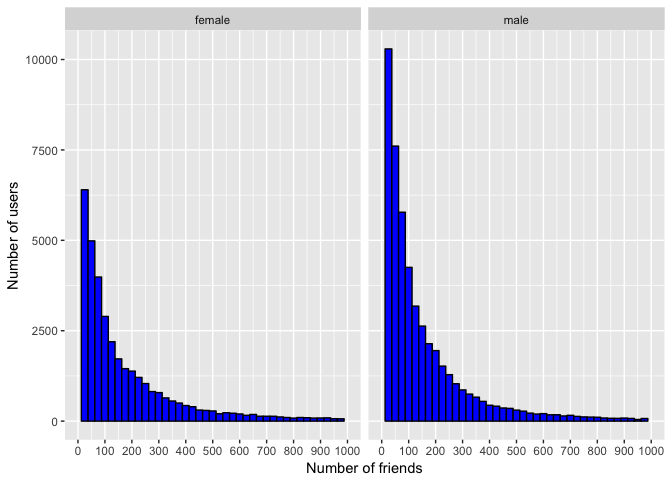
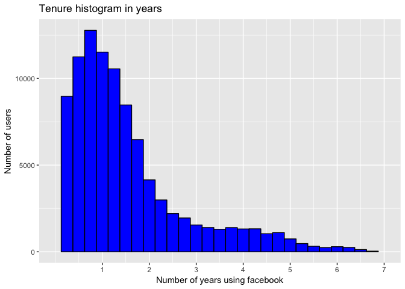
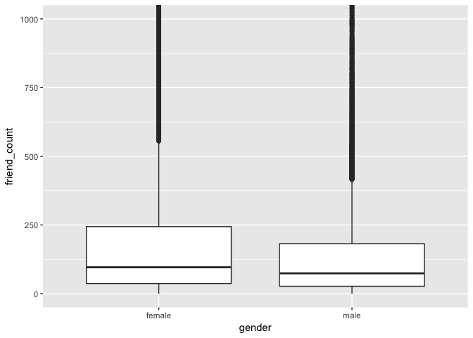
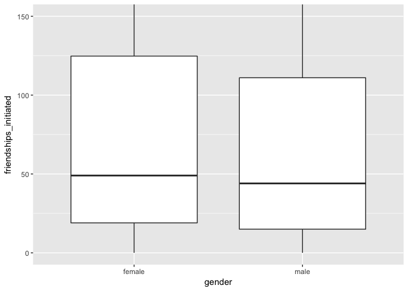

Import necessary libraries

```r
library("ggplot2")
library(gridExtra)
```

Load pseudo facebook data set

```r
pf_data_link <- "https://s3.amazonaws.com/udacity-hosted-downloads/ud651/pseudo_facebook.tsv"
pseudo_facebook <- read.csv(file=pf_data_link, sep="\t")
```

Visualize data set structure and sample

```
## 'data.frame':	99003 obs. of  15 variables:
##  $ userid               : int  2094382 1192601 2083884 1203168 1733186 1524765 1136133 1680361 1365174 1712567 ...
##  $ age                  : int  14 14 14 14 14 14 13 13 13 13 ...
##  $ dob_day              : int  19 2 16 25 4 1 14 4 1 2 ...
##  $ dob_year             : int  1999 1999 1999 1999 1999 1999 2000 2000 2000 2000 ...
##  $ dob_month            : int  11 11 11 12 12 12 1 1 1 2 ...
##  $ gender               : Factor w/ 2 levels "female","male": 2 1 2 1 2 2 2 1 2 2 ...
##  $ tenure               : int  266 6 13 93 82 15 12 0 81 171 ...
##  $ friend_count         : int  0 0 0 0 0 0 0 0 0 0 ...
##  $ friendships_initiated: int  0 0 0 0 0 0 0 0 0 0 ...
##  $ likes                : int  0 0 0 0 0 0 0 0 0 0 ...
##  $ likes_received       : int  0 0 0 0 0 0 0 0 0 0 ...
##  $ mobile_likes         : int  0 0 0 0 0 0 0 0 0 0 ...
##  $ mobile_likes_received: int  0 0 0 0 0 0 0 0 0 0 ...
##  $ www_likes            : int  0 0 0 0 0 0 0 0 0 0 ...
##  $ www_likes_received   : int  0 0 0 0 0 0 0 0 0 0 ...
```

```
##    userid age dob_day dob_year dob_month gender tenure friend_count
## 1 2094382  14      19     1999        11   male    266            0
## 2 1192601  14       2     1999        11 female      6            0
## 3 2083884  14      16     1999        11   male     13            0
## 4 1203168  14      25     1999        12 female     93            0
## 5 1733186  14       4     1999        12   male     82            0
## 6 1524765  14       1     1999        12   male     15            0
##   friendships_initiated likes likes_received mobile_likes
## 1                     0     0              0            0
## 2                     0     0              0            0
## 3                     0     0              0            0
## 4                     0     0              0            0
## 5                     0     0              0            0
## 6                     0     0              0            0
##   mobile_likes_received www_likes www_likes_received
## 1                     0         0                  0
## 2                     0         0                  0
## 3                     0         0                  0
## 4                     0         0                  0
## 5                     0         0                  0
## 6                     0         0                  0
```

Friend counts histogram faceted by gender

```
## Warning: Removed 2949 rows containing non-finite values (stat_bin).
```

<!-- -->

Friend count statistics by gender

```r
by(pseudo_facebook$friend_count, pseudo_facebook$gender, summary)
```

```
## pseudo_facebook$gender: female
##    Min. 1st Qu.  Median    Mean 3rd Qu.    Max. 
##       0      37      96     242     244    4923 
## -------------------------------------------------------- 
## pseudo_facebook$gender: male
##    Min. 1st Qu.  Median    Mean 3rd Qu.    Max. 
##       0      27      74     165     182    4917
```

Tenure histogram in years

```
## Warning: Removed 26 rows containing non-finite values (stat_bin).
```

<!-- -->

User's age histogram
<!-- -->

Three different friend's count histograms: 1) Count, 2) Base 10 log transformation of count, and 3) Square root transformation of count 

```
## Warning: Removed 628 rows containing non-finite values (stat_bin).

## Warning: Removed 628 rows containing non-finite values (stat_bin).
```

```
## Warning: Removed 1 rows containing missing values (geom_bar).
```

```
## Warning: Removed 628 rows containing non-finite values (stat_bin).
```

```
## Warning: Removed 1 rows containing missing values (geom_bar).
```

<!-- -->

Frequency polygons of number of likes by gender

```
## Warning: Transformation introduced infinite values in continuous x-axis
```

```
## `stat_bin()` using `bins = 30`. Pick better value with `binwidth`.
```

```
## Warning: Removed 60935 rows containing non-finite values (stat_bin).
```

```
## Warning: Removed 4 rows containing missing values (geom_path).
```

<!-- -->

What's the males like count and who has more likes, males or females?

```
## pseudo_facebook$gender: female
## [1] 3507665
## -------------------------------------------------------- 
## pseudo_facebook$gender: male
## [1] 1430175
```

Who has more friends, males or females?
Boxplot of friend count by gender
<!-- -->
Numerical summary of friend count by gender

```
## pseudo_facebook$gender: female
##    Min. 1st Qu.  Median    Mean 3rd Qu.    Max. 
##       0      37      96     242     244    4923 
## -------------------------------------------------------- 
## pseudo_facebook$gender: male
##    Min. 1st Qu.  Median    Mean 3rd Qu.    Max. 
##       0      27      74     165     182    4917
```

Who initiated more friendships, males or females?
Boxplot of friendships initiated by gender
<!-- -->
Numerical summary of friendships initiated by gender

```
## pseudo_facebook$gender: female
##    Min. 1st Qu.  Median    Mean 3rd Qu.    Max. 
##     0.0    19.0    49.0   113.9   124.8  3654.0 
## -------------------------------------------------------- 
## pseudo_facebook$gender: male
##    Min. 1st Qu.  Median    Mean 3rd Qu.    Max. 
##     0.0    15.0    44.0   103.1   111.0  4144.0
```

Create new logical variable to identify if an user has ever logged in using a mobile device

```r
pseudo_facebook$mobile_check_in <- ifelse(pseudo_facebook$mobile_likes > 0, 1, 0)
pseudo_facebook$mobile_check_in <- factor(pseudo_facebook$mobile_check_in)
summary(pseudo_facebook$mobile_check_in)
```

```
##     0     1 
## 35056 63947
```
What percentage of users check in using mobile?

```
## [1] 0.6459097
```
  


