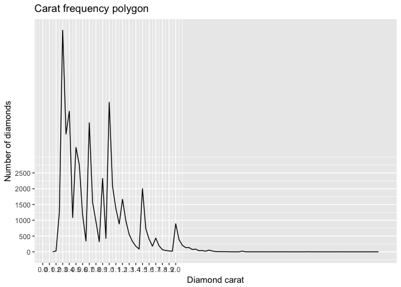

Import necessary libraries and data sets

```r
library(ggplot2)
data(diamonds)
```

Setting seed for reproducibility

```r
set.seed(1234)
```

Histogram of diamond prices

```r
dp_hist <- qplot(x = price, data = diamonds, binwidth = 30
      , color = I('black'), fill = I('blue')) +
  xlab("Diamond prices") +
  ylab("Number of diamonds") +
  scale_x_continuous(limits = c(0, 1500), breaks = seq(0, 1500, 100))
dp_hist
```

<!-- -->

Zooming into the histogram's peak

```r
dp_hist +
  scale_x_continuous(limits = c(0, 1500), breaks = seq(0, 1500, 100))
```

<!-- -->

How many diamonds cost less than $500?

```r
nrow(subset(diamonds, price < 500))
```

```
## [1] 1729
```
How many diamonds cost less than $250?

```r
nrow(subset(diamonds, price < 250))
```

```
## [1] 0
```
How many diamonds cost $15000 or more?

```r
nrow(subset(diamonds, price <= 15000))
```

```
## [1] 52285
```


```r
qplot(x = price, data = diamonds, binwidth = 30
      , color = I('black'), fill = I('blue')) +
  xlab("Diamond prices") +
  ylab("Number of diamonds") +
  facet_wrap(~cut, scales="free_y") +
  ggtitle("Histograms of diamond prices by cut")
```

<!-- -->

Numerical summary of diamond prices by cut

```r
by(diamonds$price, diamonds$cut, summary, digits = max(getOption('digits')))
```

```
## diamonds$cut: Fair
##    Min. 1st Qu.  Median    Mean 3rd Qu.    Max. 
##     337    2050    3282    4359    5206   18574 
## -------------------------------------------------------- 
## diamonds$cut: Good
##    Min. 1st Qu.  Median    Mean 3rd Qu.    Max. 
##     327    1145    3050    3929    5028   18788 
## -------------------------------------------------------- 
## diamonds$cut: Very Good
##    Min. 1st Qu.  Median    Mean 3rd Qu.    Max. 
##     336     912    2648    3982    5373   18818 
## -------------------------------------------------------- 
## diamonds$cut: Premium
##    Min. 1st Qu.  Median    Mean 3rd Qu.    Max. 
##     326    1046    3185    4584    6296   18823 
## -------------------------------------------------------- 
## diamonds$cut: Ideal
##    Min. 1st Qu.  Median    Mean 3rd Qu.    Max. 
##     326     878    1810    3458    4678   18806
```


```r
qplot(x = (price/carat), data = diamonds, binwidth = .05
      , color = I('black'), fill = I('blue')) +
  xlab("Diamond price per carat") +
  ylab("Number of diamonds") +
  scale_x_log10() +
  facet_wrap(~cut, scales="free_y") +
  ggtitle("Histogram of price per carat faceted by cut")
```

<!-- -->


```r
qplot(x = carat, data = diamonds, geom = 'freqpoly', binwidth=.05) +
  scale_x_continuous(breaks=seq(0, 2, .1)) +
  scale_y_continuous(breaks=seq(0, 2500, 500)) +
  xlab("Diamond carat") +
  ylab("Number of diamonds") +
  ggtitle("Carat frequency polygon")
```

<!-- -->

