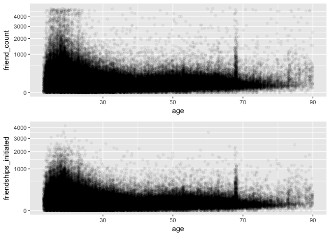
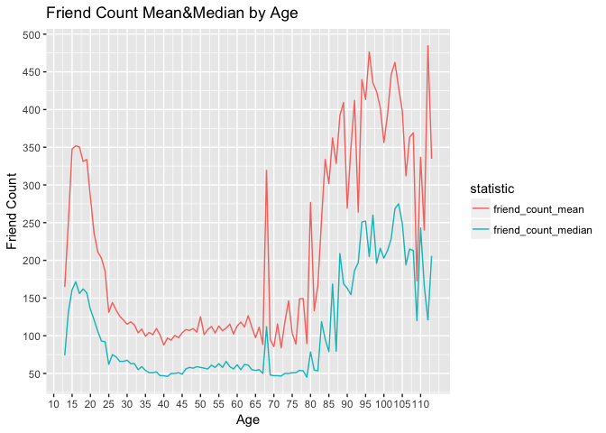
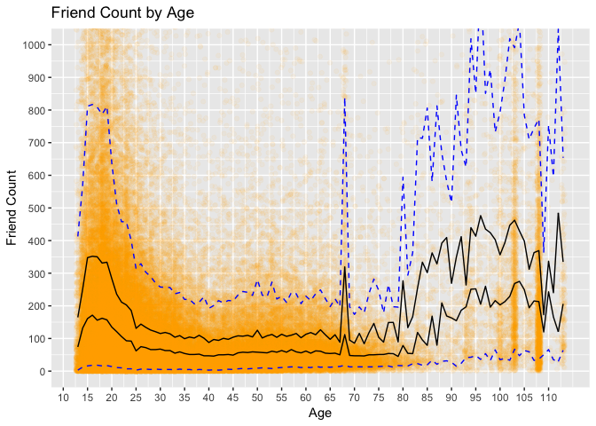
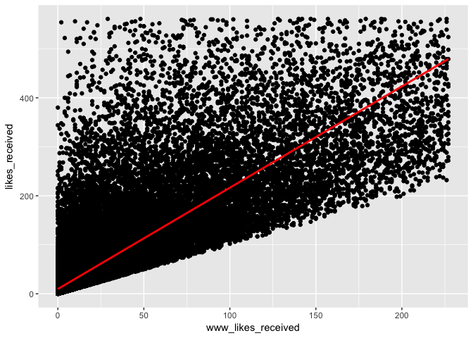
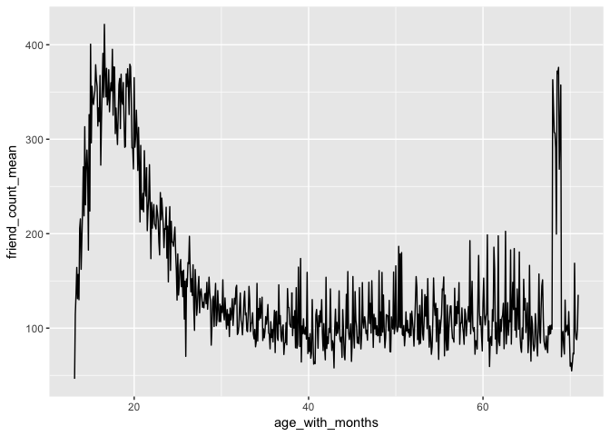
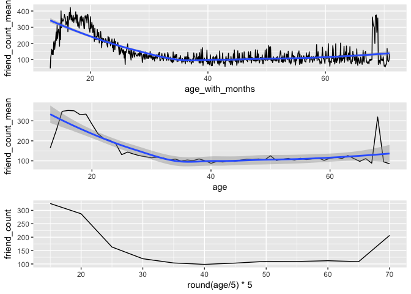

Import necessary libraries

```r
library(RCurl)
library(ggplot2)
library(gridExtra)
library(dplyr) 
library(tidyr)
```

Setting seed for reproducibility

```r
set.seed(1234)
```

Load pseudo facebook data set

```r
destfile <- "input/pseudo_facebook.tsv"

if(!file.exists(destfile)){
  download.file("https://s3.amazonaws.com/udacity-hosted-downloads/ud651/pseudo_facebook.tsv",destfile=destfile,method="libcurl")
}
pseudo_facebook <- read.csv(file=destfile, sep="\t")
```

Relationship between age and friend count

```r
p1 <- ggplot(aes(x=age, y=friend_count), data=pseudo_facebook) + 
  geom_jitter(alpha=1/20, position = position_jitter(h = 0)) + 
  xlim(13, 90) +
  coord_trans(y="sqrt")
```

Relationship between age and friendship initiatied

```r
p2 <- ggplot(aes(x=age, y=friendships_initiated), data=pseudo_facebook) + 
  geom_jitter(alpha=1/20, position = position_jitter(h = 0)) + 
  xlim(13, 90) +
  coord_trans(y="sqrt")
```


```r
grid.arrange(p1, p2, nrow=2)
```

<!-- -->

Calculate mean/median/count statistics for each age

```r
pf.fc_by_age <- pseudo_facebook %>%
  group_by(age) %>% 
  summarise(friend_count_mean = mean(friend_count)
            , friend_count_median = median(friend_count)
            , n = n()) %>%
  arrange(age)

pf.fc_by_age2 <- gather(pf.fc_by_age, "statistic", "friend_count", friend_count_mean:friend_count_median)
```


```r
ggplot(aes(x=age, y=friend_count, color=statistic), data=pf.fc_by_age2) + 
  xlab("Age") +
  ylab("Friend Count") +
  ggtitle("Friend Count Mean&Median by Age") +
  scale_x_continuous(breaks=seq(10, max(pf.fc_by_age2$age), 5)) +
  scale_y_continuous(breaks=seq(0, 500, 50)) +
  geom_line()
```

<!-- -->

Observations from the above plot are:
* Spike at the age of 16 that gradually decreases up to the age of 25.
* Strong spike at the age of 69.
* High variability in friend count starting at the age of 80.


```r
ggplot(aes(x=age, y=friend_count), data=pseudo_facebook) +
  xlab("Age") +
  ylab("Friend Count") +
  ggtitle("Friend Count by Age") +
  coord_cartesian(ylim = c(0, 1000)) +
  geom_point(alpha=.05, position = position_jitter(h = 0), color = "orange") + 
  scale_x_continuous(breaks=seq(10, max(pseudo_facebook$age), 5)) +
  scale_y_continuous(breaks=seq(0, max(pseudo_facebook$friend_count), 100)) +
  geom_line(stat = "summary", fun.y = mean) +
  geom_line(stat = "summary", fun.y = quantile, fun.args = list(probs=.1), linetype = 2, color = "blue") +
  geom_line(stat = "summary", fun.y = quantile, fun.args = list(probs=.5)) +
  geom_line(stat = "summary", fun.y = quantile, fun.args = list(probs=.9), linetype = 2, color = "blue")
```

<!-- -->

Explore the relationship between web likes (www_likes_received) and total likes (likes_received)

```r
ggplot(data=pseudo_facebook, aes(x=www_likes_received, y=likes_received)) + 
  geom_point() +
  xlim(0, quantile(pseudo_facebook$www_likes_received, 0.95)) +
  ylim(0, quantile(pseudo_facebook$likes_received, 0.95)) +
  geom_smooth(method = "lm", color = "red")
```

<!-- -->

Correlation analysis between www_likes_received and likes_received

```r
with(pseudo_facebook, cor.test(www_likes_received, likes_received))
```

```
## 
## 	Pearson's product-moment correlation
## 
## data:  www_likes_received and likes_received
## t = 937.1, df = 99001, p-value < 2.2e-16
## alternative hypothesis: true correlation is not equal to 0
## 95 percent confidence interval:
##  0.9473553 0.9486176
## sample estimates:
##       cor 
## 0.9479902
```

Calculate user age with months

```r
pseudo_facebook$age_with_months <- pseudo_facebook$age + (1-pseudo_facebook$dob_month/12)
```

Calculate mean/median/count statistics for age with months

```r
pf.fc_by_age_months <- pseudo_facebook %>%
  group_by(age_with_months) %>% 
  summarise(friend_count_mean = mean(friend_count)
            , friend_count_median = median(friend_count)
            , n = n()) %>%
  arrange(age_with_months)
```

Plot mean by age with months

```r
ggplot(data = subset(pf.fc_by_age_months, age_with_months < 71), aes(x = age_with_months, y = friend_count_mean)) + geom_line()
```

<!-- -->

Smoothing conditional means

```r
p1 <- ggplot(data = subset(pf.fc_by_age_months, age_with_months < 71), aes(x = age_with_months, y = friend_count_mean)) + 
  geom_line() + 
  geom_smooth(method = 'loess')
  
p2 <- ggplot(data = subset(pf.fc_by_age, age < 71), aes(x = age, y = friend_count_mean)) + 
  geom_line() + 
  geom_smooth(method = 'loess')

p3 <- ggplot(data = subset(pseudo_facebook, age < 71), aes(x = round(age / 5) * 5, y = friend_count)) +
               geom_line(stat = 'summary', fun.y = mean)

grid.arrange(p1, p2, p3, ncol=1)
```

<!-- -->


