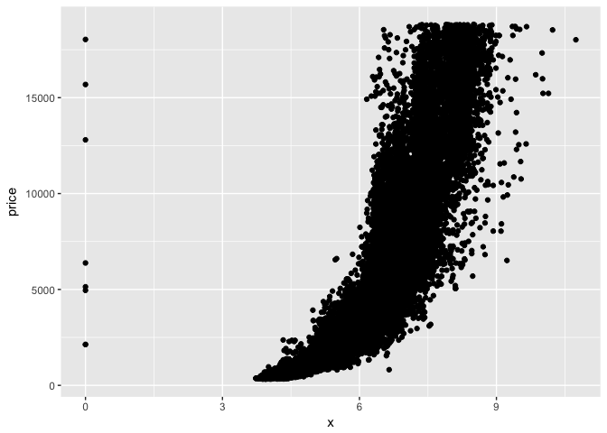
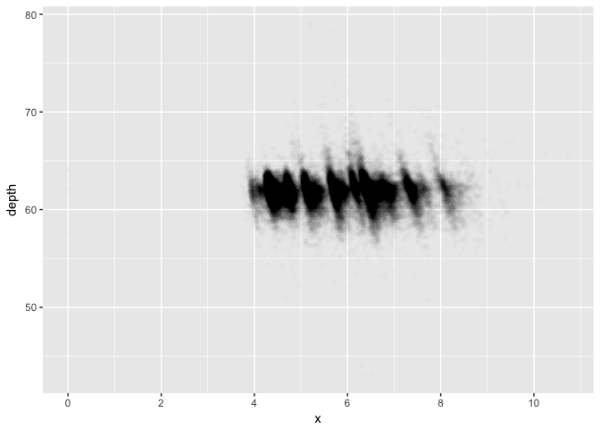
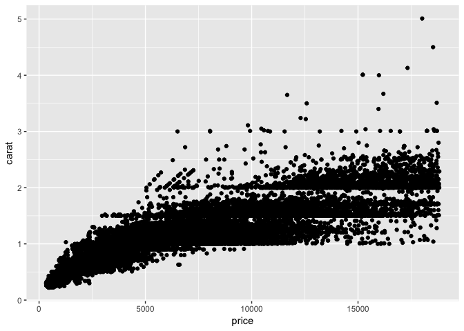
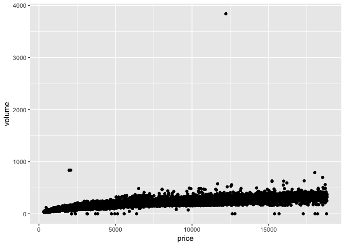
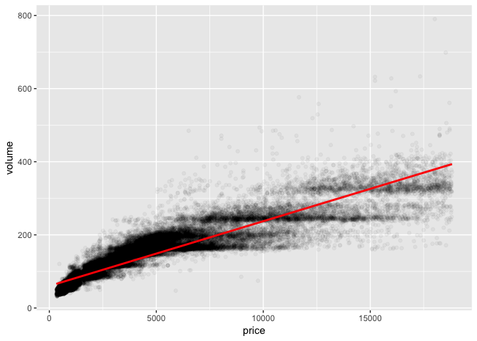
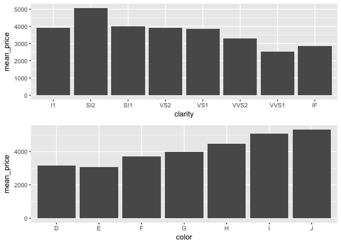

Import necessary libraries and data sets

```r
library(ggplot2)
library(gridExtra)
library(dplyr) 
library(tidyr)
data(diamonds)
```

Setting seed for reproducibility

```r
set.seed(1234)
```

Scatterplot of price vs. x

```r
ggplot(data = diamonds, aes(x = x, y = price)) + 
  geom_point() 
```

<!-- -->

* A strong non-linear (exponential) relationship between price and x
* Outliers appear when x < 3 and x > 9.5

Correlation analysis

```r
with(diamonds, cor.test(x, price))
```

```
## 
## 	Pearson's product-moment correlation
## 
## data:  x and price
## t = 440.16, df = 53938, p-value < 2.2e-16
## alternative hypothesis: true correlation is not equal to 0
## 95 percent confidence interval:
##  0.8825835 0.8862594
## sample estimates:
##       cor 
## 0.8844352
```

```r
with(diamonds, cor.test(y, price))
```

```
## 
## 	Pearson's product-moment correlation
## 
## data:  y and price
## t = 401.14, df = 53938, p-value < 2.2e-16
## alternative hypothesis: true correlation is not equal to 0
## 95 percent confidence interval:
##  0.8632867 0.8675241
## sample estimates:
##       cor 
## 0.8654209
```

```r
with(diamonds, cor.test(z, price))
```

```
## 
## 	Pearson's product-moment correlation
## 
## data:  z and price
## t = 393.6, df = 53938, p-value < 2.2e-16
## alternative hypothesis: true correlation is not equal to 0
## 95 percent confidence interval:
##  0.8590541 0.8634131
## sample estimates:
##       cor 
## 0.8612494
```

Scatterplot of price vs. depth

```r
ggplot(data = diamonds, aes(x = x, y = depth)) + 
  geom_jitter(alpha=1/100, position = position_jitter(h = 0)) +
  scale_x_continuous(breaks=seq(0, 10, 2))
```

<!-- -->

Correlation analysis of depth vs price

```r
with(diamonds, cor.test(depth, price))
```

```
## 
## 	Pearson's product-moment correlation
## 
## data:  depth and price
## t = -2.473, df = 53938, p-value = 0.0134
## alternative hypothesis: true correlation is not equal to 0
## 95 percent confidence interval:
##  -0.019084756 -0.002208537
## sample estimates:
##        cor 
## -0.0106474
```

Scatterplot of price vs. carat (Excluding top 1% percentile of both variables)

```r
ggplot(data = subset(diamonds, price > unname(quantile(price, .01)) | carat > unname(quantile(carat, .01))), aes(x = price, y = carat)) +
  geom_point()
```

<!-- -->

Scatterplot of price vs. volume

```r
diamonds$volume = diamonds$x * diamonds$y * diamonds$z
ggplot(data = diamonds, aes(x = price, y = volume)) +
  geom_point()
```

<!-- -->

Correlation analysis between price and volume

```r
with(subset(diamonds, volume > 0 & volume <= 800), cor.test(price, volume))
```

```
## 
## 	Pearson's product-moment correlation
## 
## data:  price and volume
## t = 559.19, df = 53915, p-value < 2.2e-16
## alternative hypothesis: true correlation is not equal to 0
## 95 percent confidence interval:
##  0.9222944 0.9247772
## sample estimates:
##       cor 
## 0.9235455
```

Scatterplot of price vs. volume (Excluding outliers)

```r
ggplot(data = subset(diamonds, volume > 0 & volume <= 800), aes(x = price, y = volume)) +
  geom_jitter(alpha=1/25, position = position_jitter(h = 0)) +
  geom_smooth(method = "lm", color = "red")
```

<!-- -->

New diamonds dataframe arranged by clarity

```r
diamondsByClarity <- diamonds %>%
  group_by(clarity) %>% 
  summarise(mean_price = mean(price)
            , median_price = median(price)
            , min_price = min(price)
            , max_price = max(price)
            , n = n()) %>%
  arrange(clarity)
```

Bar plots of mean price by clarify and color

```r
diamonds_by_clarity <- group_by(diamonds, clarity)
diamonds_mp_by_clarity <- summarise(diamonds_by_clarity, mean_price = mean(price))

p1 <- ggplot(data = diamonds_mp_by_clarity, aes(x = clarity, y = mean_price)) + geom_col()

diamonds_by_color <- group_by(diamonds, color)
diamonds_mp_by_color <- summarise(diamonds_by_color, mean_price = mean(price))

p2 <- ggplot(data = diamonds_mp_by_color, aes(x = color, y = mean_price)) + geom_col()

grid.arrange(p1, p2, ncol=1)
```

<!-- -->


